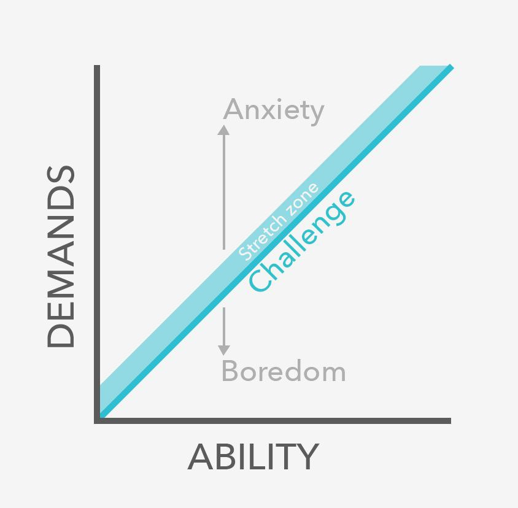
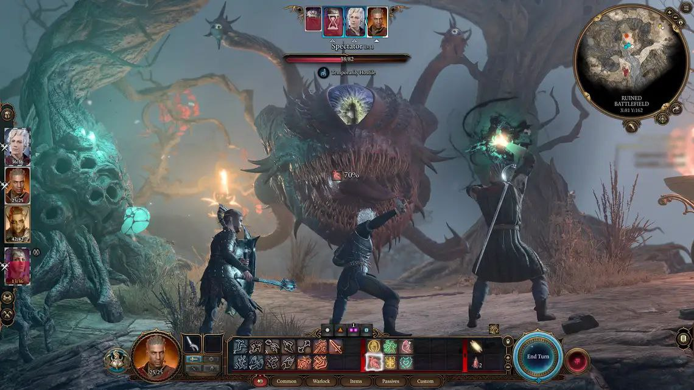
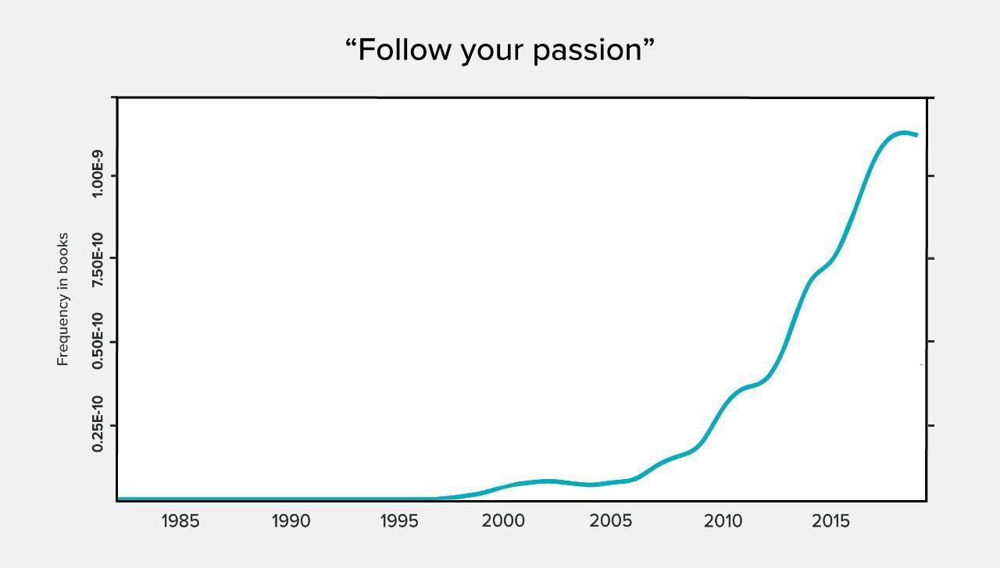
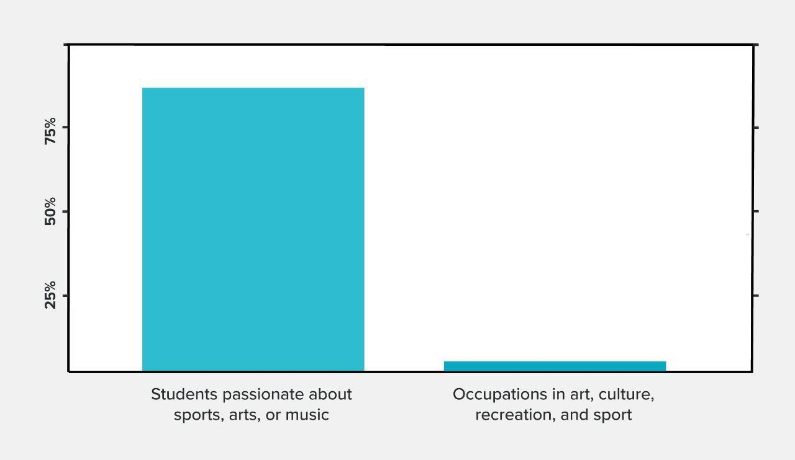

در بالا دو محور میزان توانایی و میزان سختی کار را می‌توانید مشاهده کنید. سختی بیش از حد یک مسئولیت باعث اضطراب و راحتی بیش از حداش باعث بی‌حوصله‌گی می‌‌شود. در این بین مرز باریکی وجود دارد که در اینجا آن را چالش اسم گذاشتند اما در کتاب‌ها و مطالب خودیاری دیدم که به این موضوع flow یا غرقه ‌هم می‌گونید.

حالا که نه پول و نه کار بدون استرس باعث رضایت شغلی می‌شود. بالاخره ویژگی‌های یک شغل خوب چیست؟
مقاله ۶ عامل را برای یک شغل رویایی اسم می‌برد.

.کاری که درگیر کننده(Engaging) باشد
 
می‌شد جذاب هم ترجمه کرد فقط منظور از جذاب خوشگل نیست. جذاب به معنی جذب کننده.

نه پول نه مزایای یک کار باعث رضایت شغلی نمی‌شود بلکه محتوای کاری است که شما در زمان کار انجام می‌دهید.
محتوای کار است که باعث می‌شود شما به کار ادامه بدهید بی‌حوصله نشید و حقوق پایین را تحمل کنید(نه حقوق خیلی پایین)  بازی های کامپیوتری نمونه بسیار خوبی از یک کار درگیر کننده و جذاب هستند. کاری درگیر کننده و جذب کننده است که ویژگی‌های زیر را داشته باشد.

1. آزادی در نحوه انجام فعالیت
2. وظایف شفاف و مشخص
3. تنوع در وظایف
4. بازخورددهی برای اینکه بفهمید کار چقدر خوب انجام میدهید.
نتایج تحقیقات نشان می‌دهد که هر کدام از عوامل بالا همبستگی با رضایت شغلی دارند(r=0.4).

با این وجود باز‌ی‌های کامپیوتری کلید یک زندگی رضایت بخش نیستند(نه فقط چون پول برای بازی کردن نمی‌دهند). چون شما احتیاج به چیز دیگری دارید...

چند روز پیش فردی با اسم یکی از ماشین‌های قدیمی بهم گفت که سر اون مطلبی که گذاشتی شبانه‌روز در حال بازی کردن هستم سریع‌تر ادامه مطلب بزار. واضحه که به شوخی گفت چون مطالب من تاثیر گذاری ندارند. 

اما دلیلی که گیمر شدن را به عنوان شغل نباید انتخاب کرد شاید عجیب باشد و از پند اندرزهای بابابزرگ‌ها در آمده باشد. اما این دوستان چند مقاله و متا آنالیز در این باره معرفی میکنند و این طور به نظر میرسد که شواهد زیادی برای این ادعا دارند.

کاری که به دیگران کمک میکند

مشاغلی که افراد در آنها خیری به بشر نمی‌رسانند بیشتر کار خود را بی‌معنی توصیف میکنند. مثلا طراحان مد و یا کارگردانان برنامه‌های خبری ویژگی‌های شغل درگیر کننده را دارند اما این افراد از شغل خود راضی نیستند چون احساس می‌کنند کارشان بی معنی است اما در عوض پرستارها و جراحان مغز اعصاب بیشتر کار خودشان را معنی‌دار میدانستند و رضایت شغلی بیشتری داشتند.
 تحقیق دیگری نشان می‌دهد که در سراسر دنیا افرادی که به خیریه کمک می‌کنند رضایت‌شان از زندگی معادل افرادی با درآمد دوبرابر آنها است.

کاری که در آن خوب هستید

مهارت در کار باعث احساس توانمندی در افراد می‌شود. همچنین فردی که در کاری تبحر دارد قدرت چانه زنی بیشتری در سایر عوامل یک شغل خوب را دارد. مثلا می‌تواند پروژه‌‌هایی را انتخاب کند که برای‌اش معنی‌دار هستند و یا وظایفی را قبول کند که چالش برانگیز هستند.

خوب بودن در کاری، باعث علاقمند شدن به کار می‌شود. اما برعکس این شکلی کار نمی‌کند مثلا اگر عاشق هنر و طراحی باشید و استعدادی در  آن نداشته باشید در نهایت یک کار گرافیکی خسته کننده برای شرکتی که اهمیتی برای شما ندارد را باید انجا بدید.

اما با این وجود این به این معنی نیست حتما باید کاری که همین الان در آن خوب هستید انجام بدید. یعنی باید حداقل پتانسیل این را داشته باشید که در آن کار مهارت پیدا کنید.

کاری با همکاران حمایت‌گر

تحقیقات نشان می‌دهد که داشتن همکارانی که شبیه شما هستند و یا در مشکلات به شما کمک می‌کنند بخش خیلی مهمی از یک کار رضایت بخش است‌ و به نظر میرسه که این ویژگی ضریب‌ همبستگی خیلی عجیبی با رضایت شغلی دارد.(r=0.56)
ضریب همبستگی 1 بین دو متغییر یعنی دو متغییر یک متغییر هستند. 0.56 یعنی در بیشتر از نصف مواقع افرادی که همکاران خوبی دارند از شغل‌شون راضی هستند.

کاری که متناسب با بقیه زندگی شماست

و آخرین مورد هم اهمیت دارد چون شغل حتما نباید شمال همه موارد بالا باشد. ممکن است که کاری داشته باشید که فقط از آن امرارمعاش می‌کنید اما کارهای جانبی که انجام می‌دهید برای‌تان معنی‌دار هستند. یک مثال خیلی معروف می‌تواند انیشتن در سال ۱۹۰۵ باشد. که یک کارمند ساده دفتر ثبت اختراع بود اما در اون سال چند شاخه جدید در علم فیزیک ایجاد کرد.

درنهایت شیش ماده تشکیل دهنده شغل رضایت‌بخش عبارتند از:

1. کار درگیرکنند، که به حالت غرقه‌گی وارد می‌شوید.(آزادی، تنوع، وظایف شفاف، بازخورد)

2.کاری که به دیگرا کمک می‌کند.

3.کاری که در آن خوب هستید.

4.همکاران حمایت‌گر.

5.نبود موارد منفی قابل‌توجه، مثلا ساعت‌های کاری خیلی طولانی یا حقوق غیرمنصفانه.

6.متناسب با بقیه زندگی.

20.آیا باید علاقه‌مون را دنبال کنی؟

"علاقه‌ات را دنبال کن" جمله تکراری که این روز‌ها زیاد می‌شنویم. این جمله دو مشکل دارد. مورد اول اینکه اگر کار مورد علاقه‌تان هیچ کدام از ۶ مورد بالا را نداشته باشد شغل رضایت بخشی ندارید.

و دنبال کردن علاقه اتفاقا باعث میشه که سخت‌تر به موارد بالا دست پیدا کنید چون کار مورد علاقه افراد احتمالا در حوزه بسیار رقابتی قرار دارد‌ و پیدا کردن کاری که شیش ویژگی بالا را داشته  باشد بسیار سخت است.

دوم اینکه باعث می‌شود افراد گزینه‌هاشون را محدود کنند. خیلی راحت یک فرد می‌تونه تصمیم بگیره که به ادبیات علاقه‌منده و تمامی گزینه‌های دیگه‌اش را ندید بگیرد فقط بخاطر اینکه اون گزینه‌ها در اون لحظه برای فرد رضایت‌بخش نبودند.

اما در سوی دیگر شما به یک کار علاقمند می‌شید اگر که به دیگران کمک می‌کنید یا با تمرین کردن در کارتان مهارت پیدا کنید، مسئولیت‌های درگیر کننده داشته‌ باشید یا با آدم‌هایی کارکنید که آنها را دوست دارید. به جای اینکه علاقه‌ای داشته باشید که در طول زمان ممکن است که تغییر کند. 

بلاخره به پایان این بحث رسیدیم به همگی شما که تا آخر مطلب را دنبال می‌کردید خسته نباشید میگم امیدوارم که مطالب آینده بیشتر خودم بنویسم تا اینکه ترجمه کنم.
 اما خالی از انصاف نباشه همه‌اش هم ترجمه نبود بعضی جا‌ها از کتاب‌های دیگه نقل کردم و بهش چسبوندم و بعضی جاها هم دلار به ریال تبدیل کردم.😌 
پس انقدر هم بی‌کار نشسته بودم☺️ و جدا از بیکاری من، اهمیت مطلب‌هم در درجه‌ای بود که ارزش گرفتن وقت شما و من‌ را داشته باشه.

و اما نتیجه این مطلب طولانی 

مهارت پیدا کردن در یک کاری که برای دیگران ارزشمند است باعث می‌شود که فرصت‌های شغلی زیادی داشته باشید و بتونید روی بقیه مزایای یک شغل خوب بهتر چونه بزنید. اگر فقط در یک کار خوب باشید می‌توانید کاری را قبول کنید که وظایف چالش برانگیز داشته باشد و یا همکارانی را انتخاب کنید که آنها را دوست دارید. خلاصه اکثر ویژگی‌های یک شغل خوب می‌تونید داشته باشید اگر فقط در کار مهارت داشته باشید.

اما یک ویژگی کار هست که باید جدا در نظر گرفته بشود چون با مهارت خالی بدست نمی‌آید و آن کمک کردن به دیگران است. کاری معنی‌داری است که به دیگرا کمک می‌کند. اگر به نظرتون این جملات از نصیحت‌هایی است که معمولا از بالای منبر به گوش می‌رسد باید مطالب بالا را دوباره بخوانید.

آدام گرنت در کتا‌ب بده بستان (https://taaghche.com/book/80746/%D8%A8%D8%AF%D9%87-%D9%88-%D8%A8%D8%B3%D8%AA%D8%A7%D9%86%D8%9B-%D8%B1%D9%88%DB%8C%DA%A9%D8%B1%D8%AF%DB%8C-%D8%A7%D9%86%D9%82%D9%84%D8%A7%D8%A8%DB%8C-%D8%A8%D9%87-%D9%85%D9%88%D9%81%D9%82%DB%8C%D8%AA) که به فارسی هم ترجمه شده توضیح می‌دهد که اگر‌ وظیفه خودتون را این بدونید که به دیگران کمک کنید اول دیگران به شما کمک می‌کنند که موفق بشید و بعد انگیزه‌ای که از کمک کردن بدست می‌آورید باعث می‌شود که بیشتر تلاش کنید.

با این وجود اگر که کار شما فقط کمک کردن باشد این به مرور باعث فرسودگی شغلی می‌شود پس کار باید پنج مورد دیگر که بالا ذکر شد را داشته باشد.

نتیجه
برای داشتن شغل رویایی خیلی نباید نگران پول و یا پیدا کردن یکتا علاقه ابدی بود. بلکه باید به دنبال مهارت و کاری بود که متناسب برای شما و مفید برای دنیا باشد.

به طور کلی اگر بخوایم مثل جمله کلیشه‌ای "علاقه‌ات را دنبال کن" کل مطلب را در یک جمله خلاصه کنیم آن جمله می‌شود:

"در کاری مهارت پیدا کن که به دیگرا کمک می‌کند."

#80000_hours