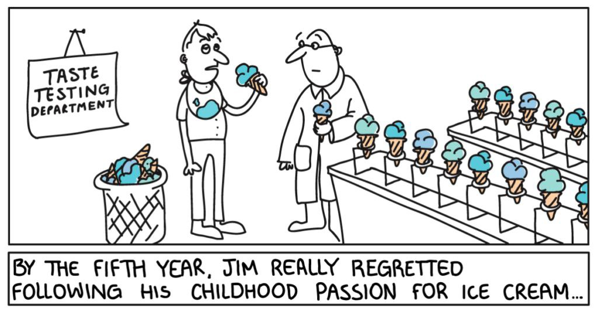
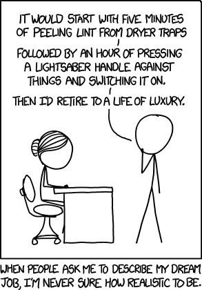
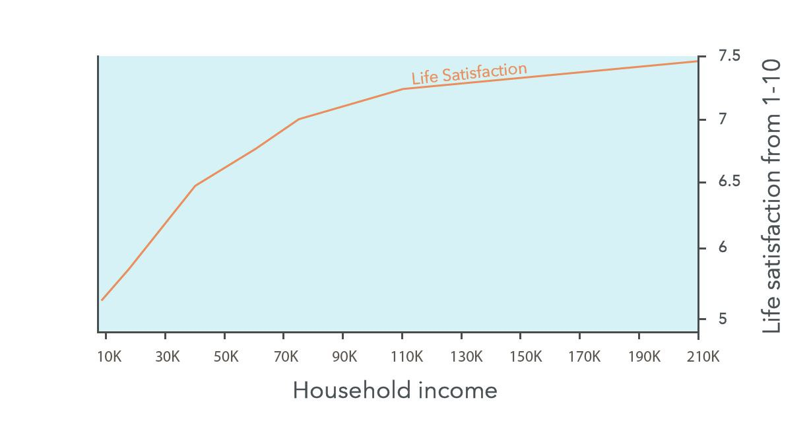
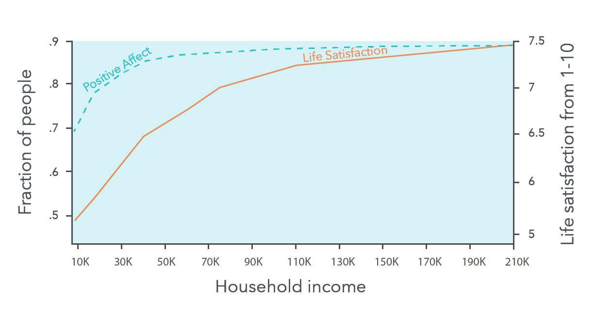
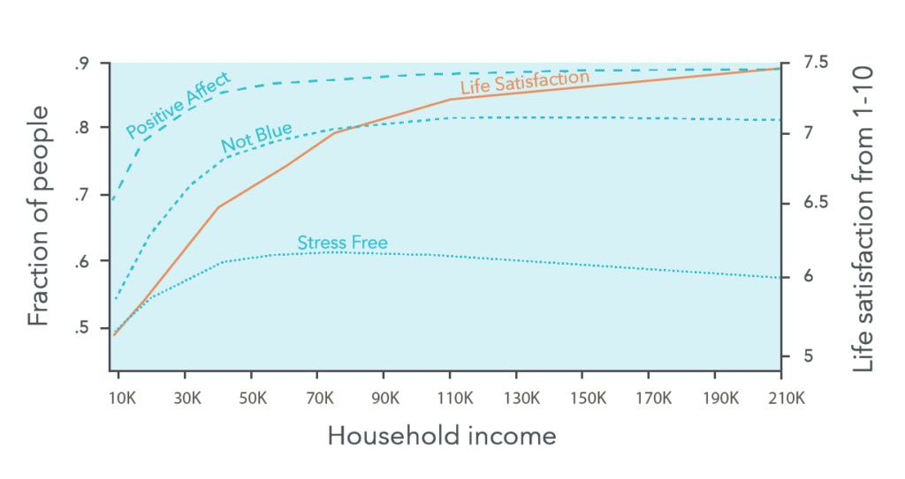

درباره این نمودار میخواستم توضیحات بیشتری بدم. من این نمودار را از سایت [80000 hours](https://80000hours.org/career-guide/job-satisfaction/) برداشتم. این‌ها یک موسسه عام‌المنفعه هستند که در رابطه با مسیر شغلی مطالب جالبی تولید می‌کنند. این دوستان از دانشگاه هاروارد فارغ‌التحصیل شدند و مطالب‌شان دقت علمی زیادی دارد. به قول خودشان ۳۰ سال است که تحقیقات مربوط به این حوزه را مطالعه می‌کنند.  
مطالب‌شان انقدر جالب و مهم بود که به فکرم رسید برخی‌شان را برای دوستانی که حوصله خواندن ندارند، یا حوصله خواندن انگلیسی را ندارند، یا با قلم من حال می‌کنند 😉 خلاصه و ترجمه کنم. اگر عضو هیچ‌کدام از دسته‌های بالا نیستید پیشنهاد می‌کنم خود مطلب را مطالعه کنید.

---

سال پنجم جیم از دنبال کردن علاقه‌ بچگی‌اش به بستنی واقعا پشیمان شده بود.

---

عموما نصیحت‌های مسیر شغلی که از جانب فردی که سعی دارد واقع‌گرا باشد را می‌شنوید: اینکه برو جایی که پول هست، و احتمالا به شما می‌گوید داروسازی یا دندانپزشکی بخوانید.  

در این رابطه، عموم معیارهای شغل خوب از دید بسیاری از افراد به موارد زیر خلاصه می‌شود:  
- آیا حقوق بالایی دارد؟  
- آیا در آینده حقوق بالایی دارد؟  
- آیا استرس‌آور است؟  
- آیا شرایط کاری ناخوشایندی دارد؟  

در کل اینکه، کاری پردرآمد و راحت باشد، به قول این مقاله *two overrated goals* برای یک شغل مناسب است.

---

پول رضایت از زندگی شما را افزایش می‌دهد اما کمی.  

نمودار بالا میزان رضایتی که افراد از زندگی خود گزارش کردند در کنار درآمد آنها را نشان می‌دهد. همان‌طور که می‌بینید فقط نیم نمره (۶.۵ تا ۷) بین افرادی که ۴۰ هزار دلار درآمد دارند با افرادی که ۸۰ هزار دلار درآمد دارند تفاوت وجود دارد.  

احتمال دارد بگویید: «ببین با این چیزی که تو می‌گویی، اگر درآمد ما را روی این نمودار بیندازی، اتفاقا پول خیلی هم ما را خوشحال می‌کند، چون درآمد ما تقسیم بر یک عدد زیادی که نرخ دلار است می‌شود و ما با پولدارتر شدن از عدد ۵ می‌آییم روی ۶.۵.»  

اما نترسید 🙂 کسی که درآمدش به ریال است، خرجش هم در اکثر اوقات به ریال است. برای مقایسه قدرت خرید ایران و آمریکا از ضریبی به اسم دلار برابری قدرت خرید یا دلار PPP استفاده می‌کنیم. امروز که این مطلب را می‌نویسم هر دلار PPP حدود ۱۵ هزار تومان است. یعنی درآمد حدود ۴۰ الی ۵۰ میلیون تومان در ماه، معادل ۴۰ هزار دلار درآمد سالانه در آمریکا برای یک خانوار است.  

---

پول بر روی رضایت کلی از زندگی تاثیر دارد (خط نارنجی)، اما بر روی شادی روزانه تاثیر خیلی کمتری دارد.  

منحنی *positive affect* میزان خوشحالی روزانه‌ای که افراد گزارش کردند را نشان می‌دهد.  
رضایت از زندگی، برآورد کلی شما از زندگی خودتان است و از خوشحالی شما در آن لحظه جداست.  

---

منحنی *not blue* (ناراحت نبودن) در مقابل درآمد افراد را نشان می‌دهد.  
و منحنی *stress free* فقدان استرس را در مقابل درآمد نشان می‌دهد. ارتباط درآمد با استرس از همه متغیرهای دیگر کمتر است.
